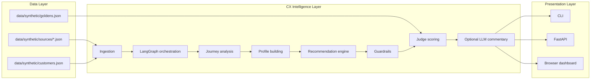

# Architecture Flow

This file shows the current runtime architecture in simple terms.

## Top-Level Architecture

## Component View

### Data Layer

- `data/synthetic/customers.json` stores customer master rows.
- `data/synthetic/sources/*.json` stores split source exports.
- `data/synthetic/events.json` stores the merged event stream.
- `data/synthetic/goldens.json` stores known scenarios for evaluation.

### Intelligence Layer

- Ingestion reads the source files and standardizes events.
- LangGraph orchestrates the main workflow.
- Journey analysis determines the stage, friction, and risk.
- Personalization converts the journey into a compact customer profile.
- Recommendation logic picks a safe next step.
- Guardrails block unauthorized or out-of-scope actions.
- Judge scoring checks whether the demo is evidence-backed and safe.

### Presentation Layer

- The CLI prints the story in a terminal-friendly format.
- The API serves JSON plus the dashboard UI.
- The browser dashboard presents the same result as a judge-friendly screen.

## One-Sentence Explanation

The system collects customer signals from multiple source feeds, unifies them into one journey, applies reasoning and guardrails, then presents the result as a safe, auditable CX demo.
