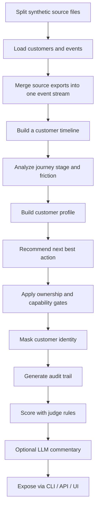

# Pipeline Guide

This project turns scattered customer signals into one governed customer story.
The current demo uses synthetic SaaS-style subscription and support data, not real customer records.

## End-to-End Flow

## Step By Step

1. **Synthetic data generation**
   - `src/cx_agent/ingestion/synthetic.py` creates customers, events, and golden scenarios.
   - `scripts/run_demo.py` and `scripts/run_api.py` use the generated files.

2. **Split source files**
   - `src/cx_agent/ingestion/files.py` groups events into `web`, `app`, `support`, `payments`, `communications`, and `surveys`.
   - These are written to `data/synthetic/sources/*.json`.

3. **Unified ingestion**
   - The pipeline loads the split source files first.
   - If needed, it falls back to `data/synthetic/events.json`, which is the merged event store.

4. **Journey building**
   - `src/cx_agent/journeys/builder.py` sorts customer events into a timeline.
   - It infers the current stage and the main friction pattern.

5. **Personalization**
   - `src/cx_agent/personalization/profile.py` converts recent behavior into a short customer profile.
   - It captures channel preference, sentiment, recent issue, and risk level.

6. **Recommendation**
   - `src/cx_agent/agents/recommendations.py` chooses the next best action from the journey and profile.
   - It stays evidence-based and returns a recommendation category plus rationale.

7. **Guardrails**
   - `src/cx_agent/guardrails/verification.py` checks region ownership, role capability, and optional PII masking.
   - A blocked gate means the action should not proceed.

8. **LangGraph orchestration**
   - `src/cx_agent/orchestration/graph.py` runs the demo as a named-node workflow.
   - Nodes build the timeline, analyze the journey, build the profile, recommend an action, verify the gates, and optionally generate an LLM explanation.

9. **Audit trail**
   - Every major node writes an audit entry.
   - The audit trail makes the demo explainable to judges.

10. **Judging**
    - `src/cx_agent/evals/judge.py` scores the output on evidence, privacy, governance clarity, auditability, and decision clarity.
    - `src/cx_agent/llm/openrouter.py` can optionally phrase the judge commentary.

11. **Presentation bundle**
    - `src/cx_agent/orchestration/pipeline.py` combines the demo, analytics, and judge score into one final bundle.
    - The CLI and UI both use that bundle.

## What The Judge Sees

- one customer story,
- one unified journey timeline,
- one recommendation,
- one governance verdict,
- one CX analytics summary,
- one audit trail,
- one final judge score.

## Why The Split Data Matters

The split source files show that the system can collect signals from multiple systems first, then combine them into one customer view.
That makes the demo easier to explain: the platform is not just reading one JSON file, it is reconciling multiple source feeds into one journey.
