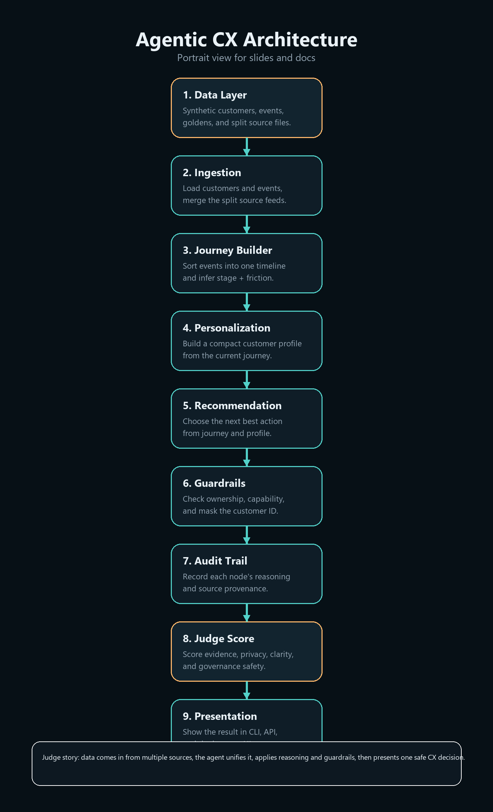
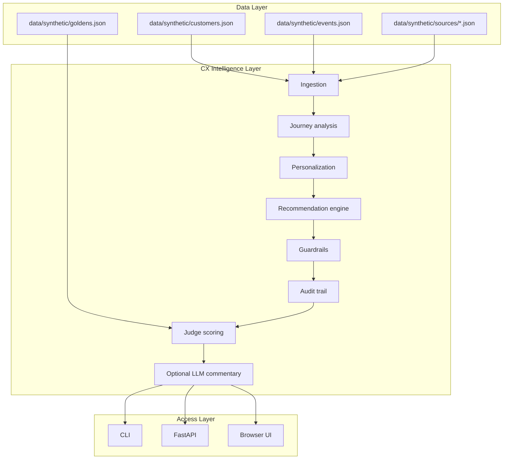

# Architecture

This project has four main layers:

1. data
2. intelligence
3. governance
4. presentation

## Portrait Diagram

## Flowchart

## Layer 1: Data

This layer stores the synthetic demo inputs.

- `data/synthetic/customers.json` - customer master records.
- `data/synthetic/sources/*.json` - split source exports.
- `data/synthetic/events.json` - merged event store.
- `data/synthetic/goldens.json` - known scenarios and expected outcomes.

## Layer 2: Intelligence

This is where the customer story is built.

- ingestion reads and merges the data,
- journey analysis detects friction,
- personalization builds a customer profile,
- recommendation chooses the next best action.

## Layer 3: Governance

This layer makes the demo safe and enterprise-ready.

- ownership checks stop actions outside the right region,
- capability checks stop actions by the wrong role,
- PII masking hides customer identity,
- audit logs show what the agent saw and did.

## Layer 4: Presentation

This is how the demo is shown to people.

- the CLI is for terminal demos,
- the API serves the structured outputs,
- the UI is the judge-facing visual story.

## Why LangGraph Is Used

LangGraph is used to make the pipeline feel like a real agent flow.
Each stage becomes a named node, so the demo can explain its own reasoning step by step.

## Why The Judge Score Exists

The score is a quick trust signal.
It tells the judge whether the output is:

- evidence-backed
- privacy-safe
- governable
- explainable
- auditable

## Short Explanation For Judges

The system ingests customer signals from multiple sources, reconstructs one journey, applies reasoning and guardrails, and then presents a safe, explainable CX decision.
