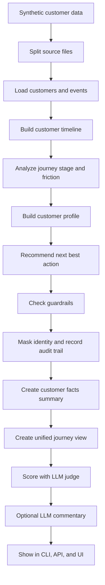

# Project Pipeline

This project is a customer journey intelligence demo.
It takes fragmented customer signals, combines them into one journey, and shows the business-safe next action.

## End-To-End Flow

## Step By Step

### 1. Generate synthetic data

- `src/cx_agent/ingestion/synthetic.py` creates the customers, events, and golden scenarios.
- The data is synthetic so the demo is safe to show and easy to explain.
- The theme is SaaS-style customer success and retention, not real customer data.

### 2. Split events by source

- `src/cx_agent/ingestion/files.py` groups events into source buckets like `web`, `app`, `support`, `payments`, `communications`, and `surveys`.
- When LLM mode is enabled, `src/cx_agent/llm/openrouter.py` can classify the source bucket from the event details instead of using only the channel name.
- This is why the demo can say it collects signals from multiple systems.
- The split files live in `data/synthetic/sources/`.

### 3. Merge source feeds into one view

- The pipeline loads the split files and turns them into one unified event stream.
- `src/cx_agent/llm/openrouter.py` then synthesizes that stream into a short unified journey view.
- This is the “one customer, many touchpoints” story.

### 4. Build the customer timeline

- `src/cx_agent/journeys/builder.py` sorts all events for one customer by time.
- The result is a clean journey timeline.
- `src/cx_agent/llm/openrouter.py` also turns that timeline into a short human-readable summary for the UI and CLI.
- This is what the UI shows as the journey strip and journey summary.

### 5. Detect the journey problem

- The journey builder looks for patterns like:
  - failed payment attempts
  - form errors
  - dropped onboarding sessions
  - reopened support tickets
  - negative survey feedback
- It then assigns a journey stage such as:
  - `onboarding_at_risk`
  - `onboarding_abandoned`
  - `renewal_at_risk`
  - `service_recovery`
  - `retained_growth`

### 6. Build a customer profile

- `src/cx_agent/llm/openrouter.py` synthesizes the profile from the journey signals.
- It captures:
  - preferred channel
  - sentiment
  - recent issue
  - product interest
  - loyalty tier
  - risk level
- This is the personalization layer.

### 7. Recommend the next best action

- `src/cx_agent/llm/openrouter.py` generates the next best action from the same evidence.
- Examples:
  - retention outreach
  - support escalation
  - onboarding recovery
  - upsell
  - nurture
- The recommendation is evidence-based, not random.

### 8. Apply guardrails

- `src/cx_agent/guardrails/verification.py` checks:
  - ownership
  - capability
  - PII masking
- If the actor does not own the region, or the role is not allowed, the action is blocked.
- This is what makes the demo safe and enterprise-friendly.

### 9. Run the LangGraph workflow

- `src/cx_agent/orchestration/graph.py` chains the steps as a LangGraph state machine.
- Each node writes an audit trail entry.
- The graph makes the pipeline feel agentic and traceable.

### 10. Produce the final demo bundle

- `src/cx_agent/orchestration/pipeline.py` combines:
  - the customer story
  - CX analytics
  - judge score
  - presentation summary
- This is the final bundle used by the CLI and UI.

### 11. Create customer facts

- `src/cx_agent/llm/openrouter.py` turns the merged customer record into a short facts summary.
- It focuses on the customer problem, source signals, and a few concise facts.
- This is what the judge and dashboard use instead of raw communications.

### 12. Score the output

- `src/cx_agent/evals/judge.py` asks the LLM judge to score the result.
- The judge returns:
  - evidence-backed
  - privacy-safe
  - governance-explained
  - audit-traced
  - decision-clear
- That score is what the judge sees.

### 13. Persist the run artifact

- Every demo run writes a JSON artifact to `data/processed/audit_runs/`.
- The artifact stores the masked payload, judge score, audit trail, and run metadata.

### 14. Optional LLM explanation

- `src/cx_agent/llm/openrouter.py` can create a short explanation if an API key is configured.
- It keeps the response short and grounded in the merged evidence.

### 15. Present it in three ways

- **CLI** for the technical demo operator.
- **API** for structured access and the dashboard.
- **UI** for the judge-friendly business presentation.

## One-Line Pitch

The pipeline turns scattered customer touchpoints into one governed, explainable customer journey with a safe next action and a judge score.
